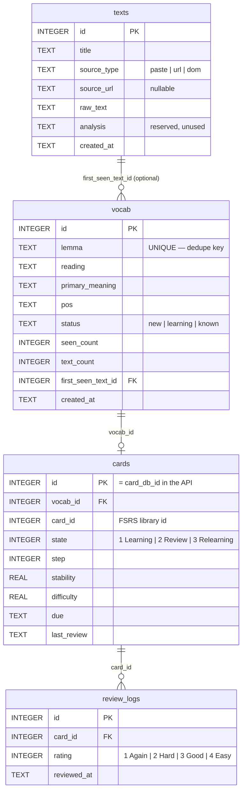

# Database Documentation

The app stores everything in a single local **SQLite** database. In development and
normal use it lives at `data/app.db` in the project root; it is created automatically
on first run (parent directory included) and is gitignored — it holds your personal
vocabulary and review history and is never committed.

The schema is defined and applied in [`server/db.py`](../server/db.py) by
`connect(path)`, which is called on every request. `connect()` is idempotent: it runs
`CREATE TABLE IF NOT EXISTS …`, so opening an existing database leaves its data intact.
Every connection enables foreign-key enforcement with `PRAGMA foreign_keys = ON`.

There are four tables:

| Table | Purpose |
|---|---|
| [`texts`](#texts) | Imported articles (paste / URL / browser DOM) |
| [`vocab`](#vocab) | Word list, deduplicated by dictionary form (lemma) |
| [`cards`](#cards) | FSRS spaced-repetition scheduling state, one per word |
| [`review_logs`](#review_logs) | One row per review (or quiz answer counted as a review) — drives stats and FSRS tuning |

## Entity relationships



The data flows **text → word → card → review**:

- A word is first encountered while reading/importing a **text**; `vocab.first_seen_text_id`
  optionally records which one (it is nullable — words saved straight from the reader may
  have no originating text row).
- Each **vocab** word that you choose to study gets exactly one **card** holding its FSRS
  schedule.
- Each time you answer a card in review, one **review_log** row is appended. Quiz answers
  optionally do the same (when submitted with `count_as_review=true`), updating the word's
  `card` and appending a `review_log` so quizzing reinforces the same FSRS schedule.

## Tables

### `texts`

Imported source material. One row per article brought in via paste, URL fetch, or the
in-app browser DOM import.

| Column | Type | Constraints | Description |
|---|---|---|---|
| `id` | INTEGER | PRIMARY KEY | Row identifier |
| `title` | TEXT | | Article title; for URL imports this is the URL |
| `source_type` | TEXT | | How it was imported: `paste`, `url`, or `dom` |
| `source_url` | TEXT | nullable | Original URL (set only for `url` imports) |
| `raw_text` | TEXT | NOT NULL | Full extracted article text |
| `analysis` | TEXT | nullable | Reserved for a cached analyzed-token JSON blob; **currently unused** (analysis is recomputed on demand) |
| `created_at` | TEXT | NOT NULL | ISO-8601 UTC timestamp of import |

### `vocab`

Your personal word list. The heart of the app's "don't re-collect words I already have"
behavior: **one row per dictionary form**.

| Column | Type | Constraints | Description |
|---|---|---|---|
| `id` | INTEGER | PRIMARY KEY | Row identifier |
| `lemma` | TEXT | NOT NULL **UNIQUE** | Dictionary form — the dedupe key. `食べた` / `食べます` / `食べる` all map here to `食べる` |
| `reading` | TEXT | nullable | Hiragana reading |
| `primary_meaning` | TEXT | nullable | Primary English gloss shown in lists |
| `pos` | TEXT | nullable | Part of speech (major class, e.g. `名詞`) |
| `status` | TEXT | NOT NULL, default `'new'` | Learning lifecycle — see [enumerations](#enumerations) |
| `seen_count` | INTEGER | NOT NULL, default `0` | Total times this lemma has been encountered |
| `text_count` | INTEGER | NOT NULL, default `0` | Number of distinct texts it has appeared in |
| `first_seen_text_id` | INTEGER | REFERENCES `texts(id)`, nullable | Text where the word was first encountered |
| `created_at` | TEXT | NOT NULL | ISO-8601 UTC timestamp |

The `UNIQUE` constraint on `lemma` is what enforces deduplication at the database level;
`upsert_vocab()` relies on it with `INSERT … ON CONFLICT (lemma) DO UPDATE`.

### `cards`

FSRS scheduling state. The columns mirror `fsrs.Card.to_dict()` field-for-field, so a row
round-trips to an identical in-memory `Card` (`save_card` / `load_card` / `update_card`).

| Column | Type | Constraints | Description |
|---|---|---|---|
| `id` | INTEGER | PRIMARY KEY | Local row id. **Exposed to the API as `card_db_id`** to distinguish it from FSRS's own `card_id` |
| `vocab_id` | INTEGER | NOT NULL, REFERENCES `vocab(id)` | The word this card schedules |
| `card_id` | INTEGER | NOT NULL | The FSRS library's own card identifier (from the `fsrs.Card` object) |
| `state` | INTEGER | NOT NULL, default `1` | FSRS state — see [enumerations](#enumerations) |
| `step` | INTEGER | NOT NULL, default `0` | FSRS learning/relearning step index |
| `stability` | REAL | nullable | FSRS stability (memory half-life, in days) |
| `difficulty` | REAL | nullable | FSRS difficulty (0–10 scale) |
| `due` | TEXT | NOT NULL | ISO-8601 timestamp the card is next due |
| `last_review` | TEXT | nullable | ISO-8601 timestamp of the most recent review |

There is no `UNIQUE` constraint on `vocab_id`, but in practice there is **one card per
word**: triage creates a card only if none exists, and `save_card` uses
`ON CONFLICT DO NOTHING` then returns the existing row. The review queue joins
`cards` to `vocab` and surfaces cards whose `due <= now`.

### `review_logs`

An append-only audit trail of every review answer. Written from day one (even before any
feature reads it) because the history is required to optimize FSRS parameters later and to
compute study statistics. Rows are appended by the review screen (`POST /review/answer`) and
by the quiz when an answer is counted as a review (`POST /quiz/answer` with
`count_as_review=true`); both paths share the same FSRS rating mapping.

| Column | Type | Constraints | Description |
|---|---|---|---|
| `id` | INTEGER | PRIMARY KEY | Row identifier |
| `card_id` | INTEGER | NOT NULL, REFERENCES `cards(id)` | The card that was reviewed (joins on `cards.id`) |
| `rating` | INTEGER | NOT NULL | The grade given — see [enumerations](#enumerations) |
| `reviewed_at` | TEXT | NOT NULL | ISO-8601 UTC timestamp of the review |

## Enumerations

These integer/text codes are not enforced by `CHECK` constraints; they are conventions the
application code maintains.

**`vocab.status`** — a word's place in the learning lifecycle:

| Value | Meaning |
|---|---|
| `new` | Default on insert; seen but not yet triaged |
| `learning` | Kept for study (triage "Keep") — has an FSRS card |
| `known` | Marked already-known (triage "Already know"); suppressed from future candidate lists |

**`cards.state`** — FSRS card state (from the `fsrs` library's `State` enum):

| Value | State |
|---|---|
| `1` | Learning |
| `2` | Review |
| `3` | Relearning |

**`review_logs.rating`** — the four FSRS grades (from the `fsrs` library's `Rating` enum):

| Value | Rating |
|---|---|
| `1` | Again |
| `2` | Hard |
| `3` | Good |
| `4` | Easy |

## Foreign keys and deletion

Every connection runs `PRAGMA foreign_keys = ON`, so referential integrity is enforced. The
foreign-key columns use plain `REFERENCES` with **no `ON DELETE` action**, which means
SQLite's default applies: you **cannot delete a parent row while child rows still reference
it** (`NO ACTION`/`RESTRICT`).

Because there is no automatic cascade, deletes must be performed in child-to-parent order in
application code. `delete_vocab(conn, vocab_id)` does exactly this:

```text
DELETE review_logs  (for every card of the vocab)
  → DELETE cards     (for the vocab)
    → DELETE vocab   (the row itself)
```

It returns `True` if a `vocab` row was actually removed, `False` if the id did not exist
(the `DELETE /vocab/{vocab_id}` endpoint turns the latter into a 404). `texts` rows are not
removed by this path; `vocab.first_seen_text_id` is nullable and historical.

## Design notes

- **Lemma-based deduplication.** `vocab.lemma` is `UNIQUE`; all inflected forms of a word
  collapse to a single dictionary-form entry.
- **Linguistic content vs. scheduling state are separate tables.** `vocab` (what a word
  *is*) and `cards` (when to *review* it) evolve independently, so re-scheduling never
  touches dictionary data and vice versa.
- **Review history from day one.** `review_logs` is populated on the first review, enabling
  later FSRS parameter optimization and the statistics dashboard.
- **Timestamps are ISO-8601 TEXT.** SQLite has no native datetime type; all time columns
  (`created_at`, `due`, `last_review`, `reviewed_at`) store ISO-8601 strings in UTC, which
  sort chronologically as text.
- **FSRS fields are persisted exactly.** The `cards` columns are a 1:1 mapping of
  `fsrs.Card.to_dict()`, so a reloaded card schedules identically to the in-memory one.

## Schema reference (DDL)

The authoritative definition lives in [`server/db.py`](../server/db.py); reproduced here for
convenience:

```sql
CREATE TABLE IF NOT EXISTS texts (
    id          INTEGER PRIMARY KEY,
    title       TEXT,
    source_type TEXT,
    source_url  TEXT,
    raw_text    TEXT NOT NULL,
    analysis    TEXT,
    created_at  TEXT NOT NULL
);

CREATE TABLE IF NOT EXISTS vocab (
    id              INTEGER PRIMARY KEY,
    lemma           TEXT NOT NULL UNIQUE,
    reading         TEXT,
    primary_meaning TEXT,
    pos             TEXT,
    status          TEXT NOT NULL DEFAULT 'new',
    seen_count      INTEGER NOT NULL DEFAULT 0,
    text_count      INTEGER NOT NULL DEFAULT 0,
    first_seen_text_id INTEGER REFERENCES texts(id),
    created_at      TEXT NOT NULL
);

CREATE TABLE IF NOT EXISTS cards (
    id          INTEGER PRIMARY KEY,
    vocab_id    INTEGER NOT NULL REFERENCES vocab(id),
    card_id     INTEGER NOT NULL,
    state       INTEGER NOT NULL DEFAULT 1,
    step        INTEGER NOT NULL DEFAULT 0,
    stability   REAL,
    difficulty  REAL,
    due         TEXT NOT NULL,
    last_review TEXT
);

CREATE TABLE IF NOT EXISTS review_logs (
    id          INTEGER PRIMARY KEY,
    card_id     INTEGER NOT NULL REFERENCES cards(id),
    rating      INTEGER NOT NULL,
    reviewed_at TEXT NOT NULL
);
```
